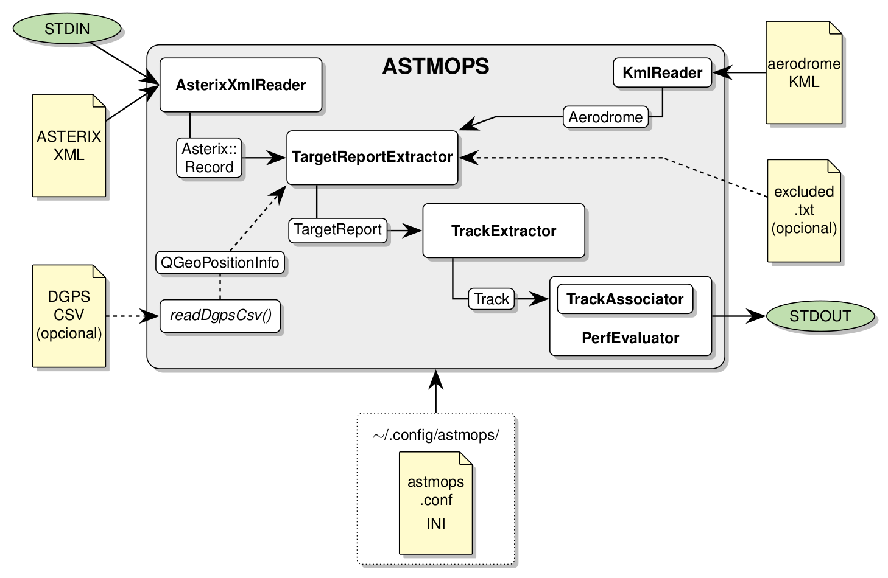

[comment]: # (
SPDX-FileCopyrightText: 2020-2021 Álvaro Cebrián Juan <acebrianjuan@gmail.com>
)

[comment]: # (
SPDX-License-Identifier: GPL-3.0-or-later
)

## What is ASTMOPS?

ASTMOPS is a command line tool for evaluating the performance of A-SMGCS sensors at airports.

## How does ASTMOPS work?

