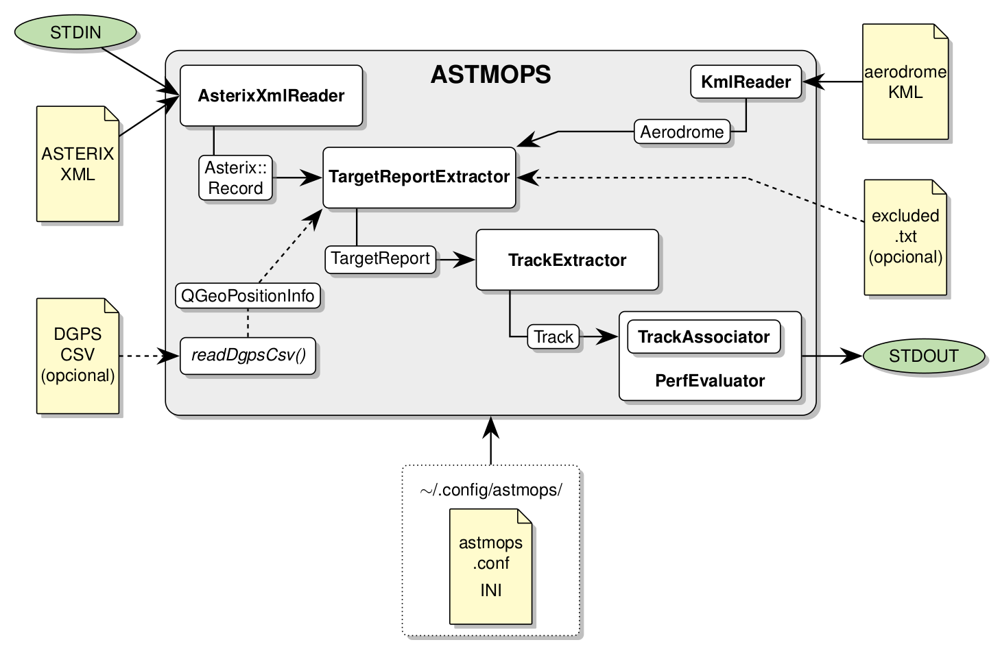

[comment]: # (
SPDX-FileCopyrightText: 2020-2021 Álvaro Cebrián Juan <acebrianjuan@gmail.com>
)

[comment]: # (
SPDX-License-Identifier: GPL-3.0-or-later
)

## What is ASTMOPS?

ASTMOPS is an open source software written in C++ that calculates EUROCAE's ED-116 and ED-117 surveillance performance metrics for Surface Movement Radar (SMR) and Multilateration (MLAT) systems on any airport using the logged data from ASTERIX recordings.

The tool makes use of ADS-B references for Targets of Opportunity (TOO) analysis and can also take Differential GPS (DGPS) references for test vehicle or flight trial analysis.

## How does ASTMOPS work?

  

